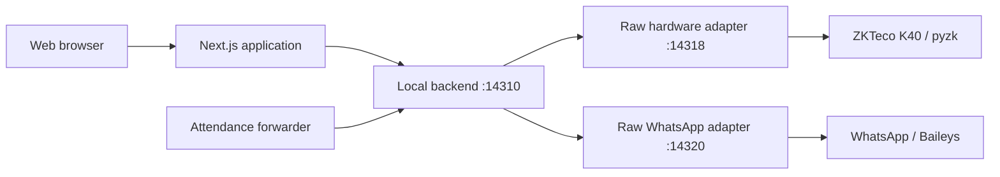

# Work completed — Okasha Institute

Updated: 24 September 2026 (Pakistan time).

This records the work completed during the Supabase setup, application fixes, local backend implementation and combined bridge packaging. Verification results describe the checks performed during that work; they are not a continuous service-health report.

## 1. Separate Supabase project

- Created and linked the institute's separate Supabase project, **Okasha Institute**, in Singapore.
- Configured the application to use that project and bootstrapped the requested first administrator.
- Added and applied four versioned migrations covering the initial schema, data integrity, fee periods, and profile links/private storage.
- Kept passwords, service credentials and local environment values outside Git. `.env.example` documents the required configuration.

## 2. Application and database fixes

- Enforced authentication and role checks on protected routes, including administration, payments, enrollment, notifications and attachments.
- Preserved Supabase row-level security for browser queries and restricted service credentials to server operations.
- Supported student and parent admissions without requiring a login account. Login-to-admission linking uses `auth_user_id` and requires deliberate administrator action.
- Fixed guardian lookup to resolve the student's `parent_id` instead of the incorrect inverse self-join. This also fixed guardian notification targeting.
- Made payment recording transactional and protected against duplicate submissions using request IDs.
- Calculated fee status from current-month payments, including partial payments, and supported downloading existing PDF receipts again.
- Restricted receipt access to authorized staff or the relevant student/parent and protected private expense attachments.
- Removed live-mode fallback to demonstration student data when database operations fail.
- Moved push secrets out of client code and replaced generated caching workers with a push-only service worker.

## 3. Separate local backend and raw bridge

Implemented the requested separation of responsibilities:

- The backend owns device settings, account targeting, phone-number normalization, the persistent command journal, reconnect preferences and application orchestration.
- The bridge accepts a command, invokes the underlying library and returns its result. It contains no institute database, fee rules, message scheduling or attendance-processing workflow.
- The backend exposes the adapters' function catalogs and serializes commands per component.
- Stable request IDs prevent duplicate execution. Outcomes that become uncertain after dispatch are recorded as uncertain and are not automatically retried.
- All local services bind to loopback. The backend and bridge use separate authentication tokens; browser users access authenticated Next.js routes.
- Bridge browser origins are unrestricted for this build, while command authentication remains required. `INSTITUTE_ALLOWED_ORIGINS` supports adding an exact-origin allowlist later.

## 4. WhatsApp connection and messaging

- Added administrator-only QR pairing, connection/account status, disconnect, reconnect and unlink controls in Settings.
- Stored the institute's session separately from the original Gymatic session, with a Windows DPAPI-protected encryption key.
- Added restoration of a saved paired session according to the backend's reconnect preference.
- Routed institute WhatsApp messages through the local backend and Baileys adapter, with explicit account targeting and delivery failures reported when disconnected.
- Verified authorized messages to the owner's own number, then verified that the saved account reconnected through the packaged bridge.
- Corrected the test guardian's phone format and verified a user-requested simulated check-in with a successful guardian WhatsApp alert. This was a simulated application event, not a physical K40 scan.

### When messages are sent

| Event | Implemented behavior |
| --- | --- |
| Add a student or guardian | Registration alone does not send a WhatsApp message. |
| New attendance punch | A nonduplicate recent punch can notify the linked guardian when the guardian has a phone number, WhatsApp notifications are enabled and the paired account is connected. Recovered punches older than five minutes do not send fresh arrival alerts. |
| Fee reminder job | When invoked, the job selects students needing reminders, respects the reminder interval and enabled channels, and uses available student/guardian contacts. |
| Collect a payment | Generates a PDF receipt; automatic WhatsApp receipt delivery is not implemented yet. |

The repository has a Vercel cron configuration for fee reminders at 09:00 Pakistan time. A local reminder scheduler was not installed. Enabling the WhatsApp switch alone does not schedule reminder jobs.

## 5. K40 integration and attendance handling

- Copied and adapted the reusable pyzk protocol code for the K40, including raw function access, identity inventory and conditional deletion safeguards.
- Added saved device ID, IP address, port, communication key and UDP controls in Settings, plus a test that reads device model and serial number.
- Used defaults of `k40-main`, port `4370` and communication key `0`; left the IP empty because the physical device is not available.
- Routed fingerprint enrollment through the backend and verified successful enrollment through template readback. Device user slots must already exist before enrollment.
- Added a backend-side attendance forwarder that reads device logs, interprets device wall times as Pakistan time and forwards normalized events without clearing device logs.
- Deduplicated attendance records in PostgreSQL and handled daily check-in/check-out alternation, including records recovered out of order.
- Kept the attendance forwarder stopped while the device remains unconfigured.

The attendance HTTP endpoint expects this application's normalized event payload; it is not a raw ADMS protocol server.

## 6. Combined Windows bridge

- Copied the hardware and WhatsApp adapter source from the original project into this repository. The original Gymatic project and services were left unchanged.
- Created an institute-branded Windows tray launcher that starts and supervises both adapters.
- Created a purple graduation-cap icon and included an icon-generation script.
- Bundled the required Python and Node runtimes with the adapters.
- Built `OkashaBridgeSetup-0.1.0.exe`, a portable directory, build metadata and SHA-256 checksums.
- Added the installer download, service status and K40 controls to the web application's Settings page.
- Kept credentials, paired sessions and local databases out of the package. Uninstall preserves local institute state.

The installer is unsigned and targets 64-bit Windows 10 or later. No Windows startup task was installed. Generated installers and portable outputs stay local and can be reproduced using [the bridge build instructions](bridge/README.md).

## 7. Verification completed

| Check | Result |
| --- | --- |
| Next.js production build | Passed |
| Backend and WhatsApp automated tests | 10 passed |
| Hardware adapter automated tests | 15 passed, using test devices/mocks |
| Application/Supabase integration assertions | 52 passed; disposable records and accounts cleaned up |
| Packaged bridge smoke test | Both adapters started, authenticated requests, exposed catalogs and shut down cleanly |
| Packaged origin policy | Verified wildcard-origin access with a valid token and rejection without authentication |
| Packaged hardware safeguard | Incomplete conditional deletion rejected before device I/O |
| Web settings | Verified both adapters running, WhatsApp connected, default K40 settings saved and connection test disabled while unconfigured |
| Installer download | HTTP 200 with the built executable available locally |
| Authorized live WhatsApp check | Owner's account reconnected and the simulated attendance alert was confirmed working |

Automated integration checks did not send notifications or operate a physical device. The authorized live messaging checks were separate.

## 8. Repository delivery

- Pushed the application fixes, bridge source, migration files, tests, documentation and build scripts to `main` in [Mashoodalimalik/institute](https://github.com/Mashoodalimalik/institute).
- Implementation commit: [`cdf69ac`](https://github.com/Mashoodalimalik/institute/commit/cdf69ac65fb37bf5a265af528532e800dda124f7).
- Retained dependency manifests and lockfiles so dependencies can be restored.
- Excluded `node_modules`, Python environments, caches, logs, local databases, credentials, generated icons and executable/build outputs.
- Scanned staged content for credential patterns and known local secrets before publishing; no matches were found.

## 9. Remaining work and limitations

- Connect the physical K40 and validate its actual network settings, model/serial response, enrollment, cards and attendance reads.
- Configure a local fee-reminder scheduler if reminders must run on this PC automatically.
- Implement automatic WhatsApp receipt delivery if required.
- Configure and verify an SMS provider if SMS is required; it is not supplied by the bridge.
- Add the final domain allowlist when the institute's deployment origins are known.
- Add signing and automatic startup if required for distribution and unattended operation.
- Design remote access to local hardware before deploying Next.js to a cloud host. A cloud server cannot reach this PC's bridge through its own `127.0.0.1`.

For setup and operation, see [README.md](README.md), [local backend documentation](local/README.md) and [bridge documentation](bridge/README.md).
