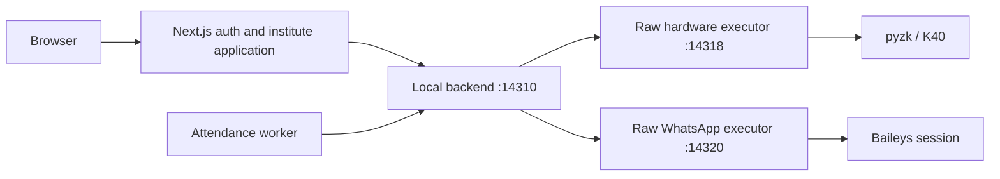

# Local service architecture



The backend and bridge use distinct bearer tokens. Both bind to loopback and return `Cache-Control: no-store`. The backend rejects browser Origin headers. The bridge accepts all origins by default; `INSTITUTE_ALLOWED_ORIGINS` can later restrict them. Every bridge command still requires the token generated by the launcher in its local data directory. The browser never receives either token. Supabase authorization remains in Next.js.

## Backend API

All routes except `/health` require `Authorization: Bearer <LOCAL_BACKEND_TOKEN>`.

| Endpoint | Purpose |
| --- | --- |
| `GET /v1/functions?component=whatsapp` | Exact bridge Baileys function catalog |
| `GET /v1/functions?component=hardware` | Exact bridge pyzk function catalog |
| `POST /v1/commands` | Validate, persist and queue a raw function call |
| `GET /v1/commands/{requestId}` | Read durable state/result/error |
| `GET /v1/whatsapp/session` | Current connection, account and unexpired QR |
| `POST /v1/whatsapp/messages` | Normalize phone, select account and queue a message |
| `GET /v1/status` | Service availability and K40 configuration status |
| `GET/POST /v1/hardware/config` | Read sanitized device settings / persist connection settings |

Example command (the K40 must be configured before dispatch):

```json
{"requestId":"unique-stable-id","component":"hardware","method":"get_attendance","arguments":{},"target":{"deviceId":"k40-main"}}
```

WhatsApp commands use `component: "whatsapp"`; message commands carry an explicit `target.accountId`. `POST /v1/whatsapp/messages` accepts `{requestId, phone, message}` and fills that target from the connected session. The caller must reuse the request ID on a retry. Methods marked `managed` in the catalog are not callable over JSON (for example functions requiring callbacks or protocol internals).

The backend maps hardware IDs to configured connection details, serializes operations per component, checks enrollment by reading the resulting fingerprint template, and owns reconnect preferences. A completed ID returns its existing result. Reusing an ID with different inputs fails. A timeout after dispatch is **uncertain**, never automatically retried. On backend restart, running jobs become uncertain and undispatched queued jobs become cancelled. Result bodies expire after 30 days; request fingerprints remain to prevent replay.

The backend supports both library catalogs; institute-specific routes expose only operations appropriate to their authenticated role. It does not give browser callers an unrestricted raw command console.

## Raw executor API

All routes except `/health` require `Authorization: Bearer <LOCAL_BRIDGE_TOKEN>`.

* `GET /v1/functions?component=whatsapp|hardware` returns available library functions and parameters.
* `POST /v1/execute` accepts `{component,method,arguments,target}` and returns `{state,result,error}` after execution.

Hardware targets contain the concrete `device` connection object supplied by the backend. The pyzk worker connects for that command, invokes the method, encodes results, and disconnects in `finally`. It never invents a device IP, polls attendance, or clears logs on its own. Baileys keeps its protocol socket and encrypted credentials, since a WhatsApp session must survive between commands. Library-level socket recovery remains in its adapter; application startup/reconnect preference belongs to the backend.

The bridge has no jobs database, tenant/controller leases, Supabase client, school settings, message templates or scheduled workflows. It does not retry submitted messages/device writes. Callers require its local bearer token. Conditional identity deletion additionally requires `target.expectedSerial` and a future ISO `target.expiresAt`; both pass through the backend and are checked against the connected device before execution. The old Gymatic service and account remain separate.

## Running

`npm run local:services` starts the combined native tray launcher and the backend. Keep Next.js running separately. `npm run local:backend` runs only the backend; `npm run local:bridge` runs the development WhatsApp adapter only. See `bridge/README.md` for native builds. Changes to environment configuration require restarting the relevant services.

`npm run test:whatsapp` tests both layers without sending messages. `npm run test:hardware` tests the Python executor with a fake device. Physical K40 behavior must be tested when the device is available.
